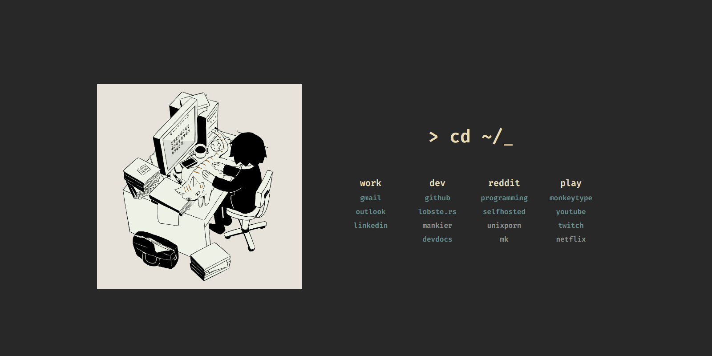

# Browser Startpage

[Live Preview](https://ashleymavericks.github.io/browser-startpage/)

- Font: Fira Code
- Colorscheme: Gruvbox Dark
- Cat Gif: [Here](https://twitter.com/avogado6/status/1165595520967954432?s=19)



## Usage Guide
To set it as your browser startpage using a browser plugin [like this one](https://addons.mozilla.org/de/firefox/addon/new-tab-override/) for firefox or [this one](https://chrome.google.com/webstore/detail/new-tab-redirect/icpgjfneehieebagbmdbhnlpiopdcmna) for chrome and then setting the url of startpage in the settings as your new tab page:

```
https://ashleymavericks.github.io/browser-startpage/
```

Alternatives:
```
https://prettycoffee.github.io/yet-another-generic-startpage/
```

## References
[Yet another generic startpage](https://github.com/PrettyCoffee/yet-another-generic-startpage)

[Startpage React Library](https://github.com/PrettyCoffee/startpage)
